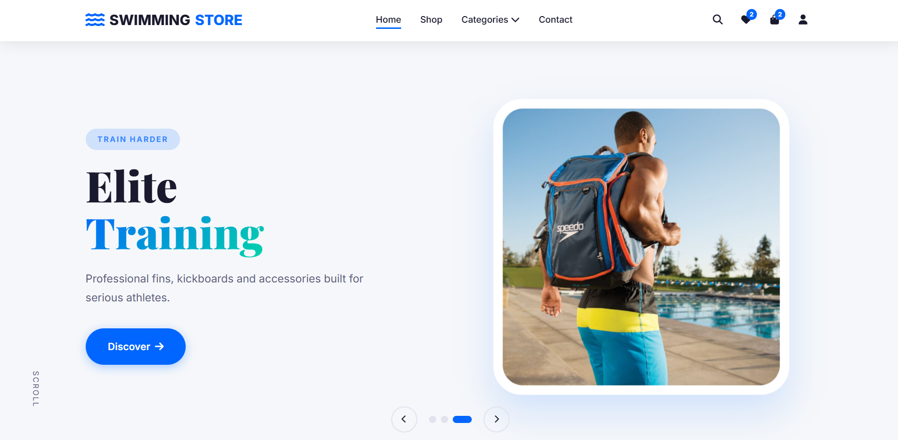
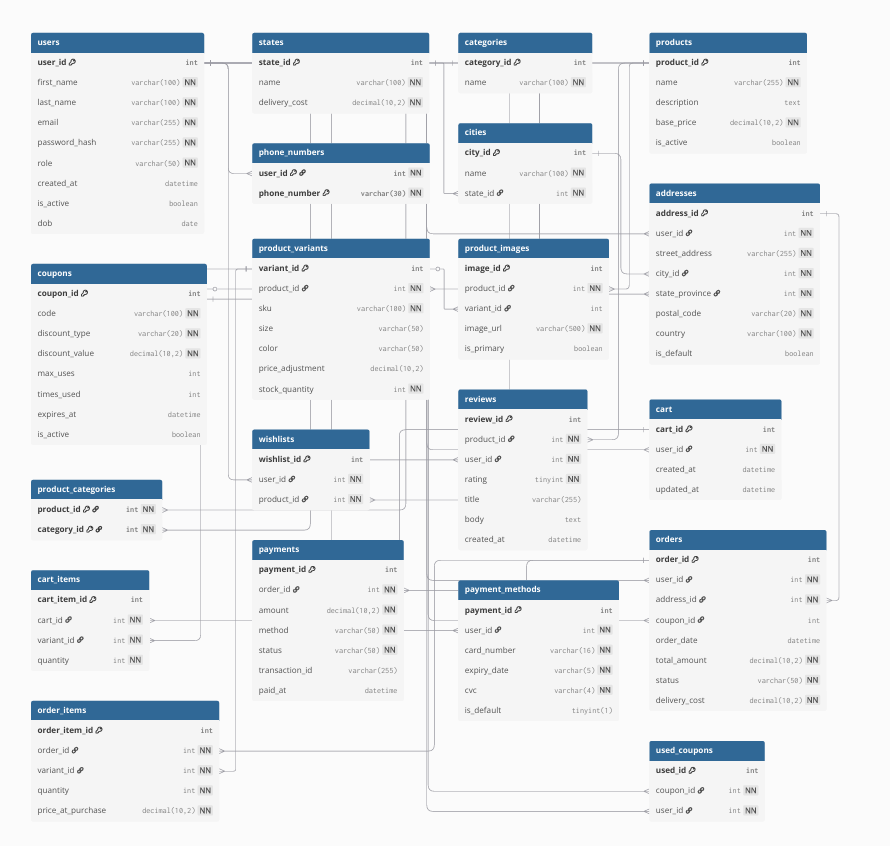

# 🏊‍♂️ Swimming Store E-Commerce Platform

A premium, full-stack e-commerce web application engineered for high performance and data integrity. This project features a decoupled architecture, pairing a highly responsive Vanilla JavaScript frontend with a robust Django REST API and a normalized MySQL relational database.

🎥 **[Watch the Full Demo Video Here]([PLACE_YOUR_VIDEO_LINK_HERE](https://drive.google.com/file/d/1IxS87H_Bs48DawQV5fGjhW2PpeKZ_CrK/view?usp=sharing))**

## ✨ System Architecture & Key Features

### 1. Advanced Product Catalog & Filtering
* **Dynamic Search & Filtering:** Implemented debounced search inputs to minimize API calls, alongside multi-parameter filtering (Category, Price Range, Sort Order).
* **Server-Side Pagination:** Utilized Django's `Paginator` to efficiently deliver data in manageable chunks, reducing database load and improving frontend rendering times.
* **Smart Asset Management:** Relational image fetching with safe fallbacks. If a product image is missing from the database, the system safely intercepts the null value and serves a local placeholder.

### 2. E-Commerce Core & Checkout Engine
* **Atomic Transactions:** The checkout process is wrapped in an `atomic` database block. Validating coupons, calculating tax/shipping, deducting inventory stock, logging payments, and generating order items either fully succeed together or roll back entirely, guaranteeing zero data corruption.
* **Real-Time Cart Math:** Frontend dynamic recalculation of totals, including handling percentage-based (Type 1) vs. flat-rate (Type 0) discount coupons.
* **Inventory Protection:** Server-side validation prevents users from adding more items to their cart than are currently available in the `ProductVariants` stock.

### 3. User Experience & Session Management
* **Cross-Tab Synchronization:** Implemented the `pageshow` event listener and cache-busting techniques (timestamped GET requests) to ensure UI elements like the Wishlist badge update instantly across multiple browser tabs without requiring a hard refresh.
* **Ghost Data Handling:** Engineered a safety net for historical data. If a product is permanently deleted from the database, past user orders dynamically render it as a "Discontinued Item" rather than crashing the API.
* **Full CRUD Profiles:** Users can securely update personal details, manage multiple addresses (with default toggles), save payment methods, and handle password resets.

## 🗄️ Database Engineering (MySQL)
This project utilizes a highly normalized (3NF) relational database schema containing over 18 interconnected tables, designed specifically for scalability.

* **Core Entities:** `Users`, `Products`, `Orders`, `Coupons`, `Reviews`.
* **Relational Junctions (Many-to-Many):** Handled via intermediate tables like `ProductCategories`, `CartItems`, and `OrderItems` to map complex relationships without data duplication.
* **Constraint Logic:** * Strict Foreign Key constraints with `DO_NOTHING` protocols ensure that historical transactions remain intact even if underlying products are removed.
    * `UniqueTogether` constraints prevent logical errors (e.g., users cannot review the same product twice, or use a single-use coupon multiple times).

## 🛠️ Technology Stack
* **Frontend:** HTML5, CSS3, Vanilla JavaScript (ES6+), FontAwesome.
* **Backend:** Python, Django 6.0.5 (REST Framework).
* **Database:** MySQL (via XAMPP) / phpMyAdmin.
* **Security:** Password Hashing (`make_password`), CORS origin management, CSRF exemption for decoupled API routing.

## 🚀 Installation & Setup

### 1. Database Setup (MySQL)
1. Ensure XAMPP is running (Start Apache and MySQL).
2. Open phpMyAdmin and create a new database named `swimstore`.
3. Import the provided SQL dump file to generate the tables, constraints, and dummy data.

### 2. Backend Setup (Django)
1. Open a terminal in the `backend` directory.
2. Create a virtual environment: `python -m venv venv`
3. Activate the environment:
   * Windows: `venv\Scripts\activate`
   * Mac/Linux: `source venv/bin/activate`
4. Install the required dependencies: `pip install -r requirements.txt`
5. Run the server: `python manage.py runserver`
*(The API will now be running at http://127.0.0.1:8000)*

### 3. Frontend Setup
1. Open the frontend folder in VS Code.
2. Ensure the `API_BASE_URL` in `js/main.js` is set to `http://127.0.0.1:8000/api`.
3. Start a local server using the VS Code "Live Server" extension.

## 📡 Comprehensive API Routing
The backend acts as a pure JSON API. Key endpoints include:
* **Authentication:** `POST /api/users/`, `POST /api/login/`
* **Products & Categories:** `GET /api/products/`, `GET /api/categories/`, `GET /api/products/<id>/related/`
* **Cart Operations:** `GET /api/cart/<user_id>/`, `POST /api/cart/`, `PUT /api/cart/items/<id>/`
* **Order Processing:** `POST /api/checkout/`, `GET /api/orders/<user_id>/`
* **User Management:** `PUT /api/users/<id>/`, `GET /api/addresses/<user_id>/`, `POST /api/reviews/add/`
